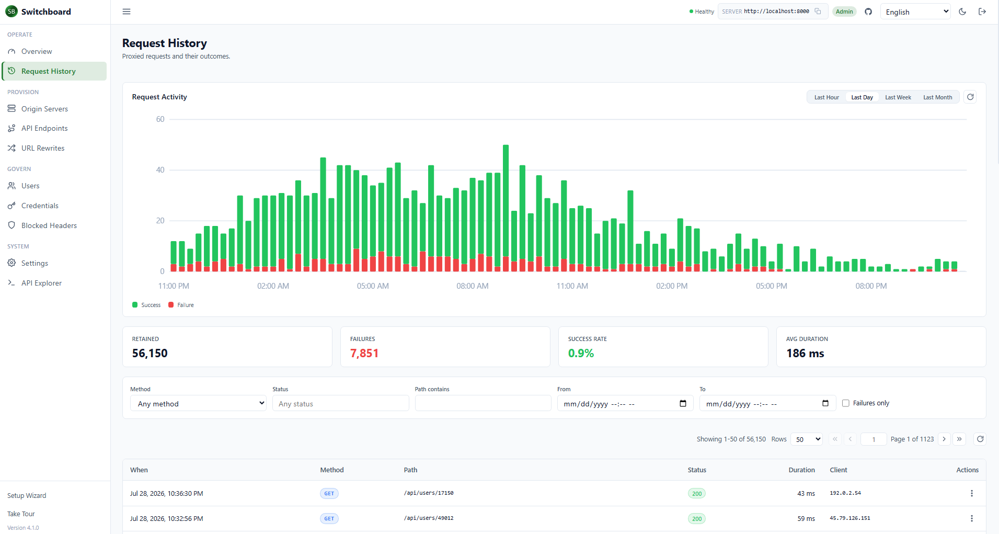
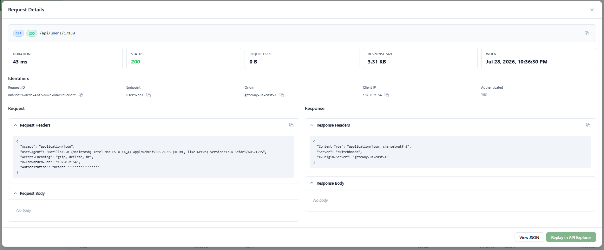
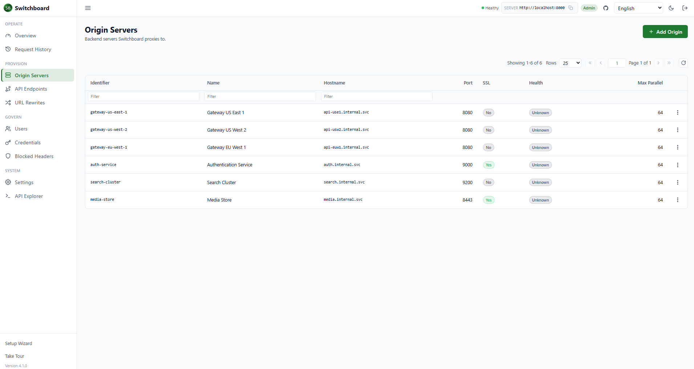
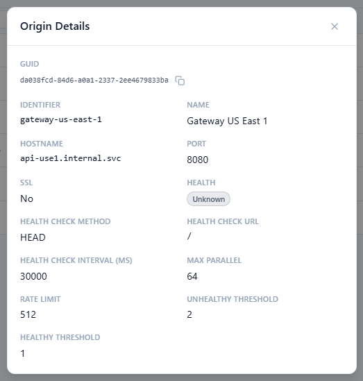
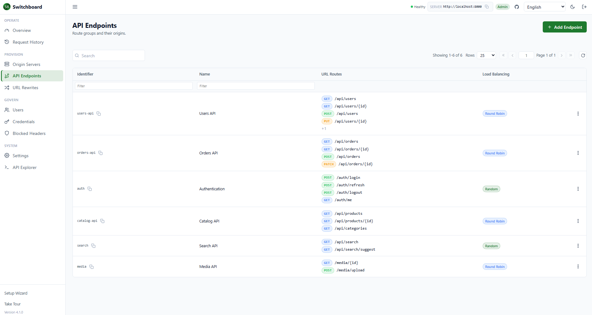
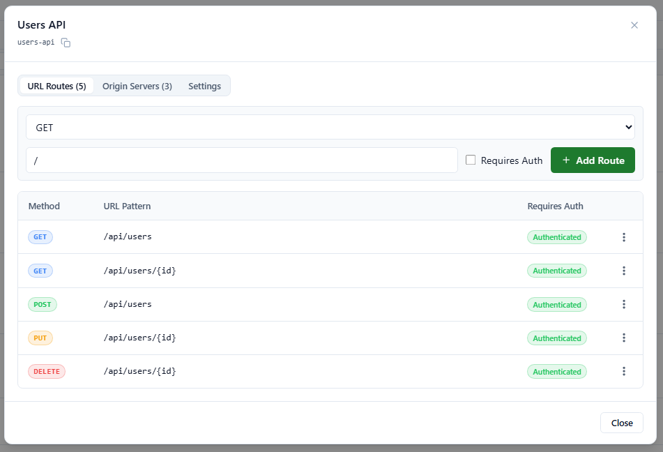
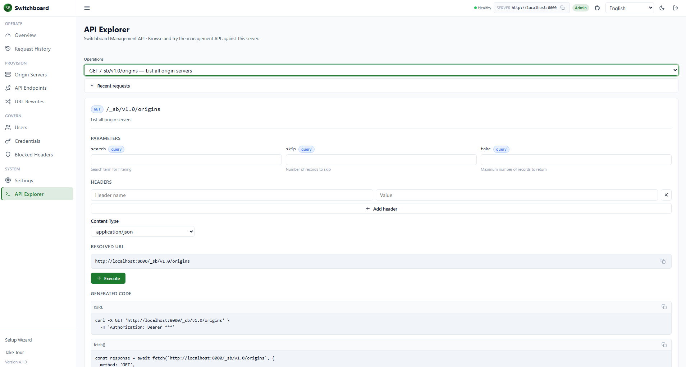

<div align="center">
  

  # Switchboard

  **A lightweight reverse proxy and API gateway for .NET**

  [](https://www.nuget.org/packages/SwitchboardApplicationProxy/) [](https://www.nuget.org/packages/SwitchboardApplicationProxy/) [](https://hub.docker.com/repository/docker/jchristn77/switchboard/general) [](https://opensource.org/licenses/MIT)
</div>

---

## Overview

Switchboard is a **production-ready reverse proxy and API gateway** that combines enterprise-grade features with .NET simplicity. Route traffic to multiple backends, automatically handle failures, enforce rate limits, and implement custom authentication—all with minimal configuration.

**🚀 Flexible Deployment:** Embed directly into your .NET application as a library or run as a standalone server.

---

## Table of Contents

- [What is Switchboard?](#what-is-switchboard)
- [What's New in v5.2.1](#whats-new-in-v521)
- [Key Features](#key-features)
- [Who is it for?](#who-is-it-for)
- [When to Use Switchboard](#when-to-use-switchboard)
- [What It Does](#what-it-does)
- [What It Doesn't Do](#what-it-doesnt-do)
- [Quick Start](#quick-start)
- [Installation](#installation)
- [Usage Examples](#usage-examples)
  - [Integrated (Library)](#integrated-library)
  - [Standalone Server](#standalone-server)
  - [Docker](#docker)
- [Configuration](#configuration)
- [Advanced Features](#advanced-features)
  - [Route Patterns and Catch-All Routes](#route-patterns-and-catch-all-routes)
  - [URL Rewriting](#url-rewriting)
  - [Authentication Context Forwarding](#authentication-context-forwarding)
  - [Server-Sent Events](#server-sent-events-sse)
  - [Chunked Transfer Encoding](#chunked-transfer-encoding)
  - [OpenAPI Documentation](#openapi-documentation)
- [Management API & Dashboard](#management-api--dashboard)
  - [Enabling the Management API](#enabling-the-management-api)
  - [Running the Dashboard](#running-the-dashboard)
  - [Database Configuration](#database-configuration)
  - [Request History](#request-history)
- [Observability](#observability)
- [Support](#support)
- [Contributing](#contributing)
- [License](#license)
- [Version History](CHANGELOG.md)

---

## What is Switchboard?

Switchboard is a **lightweight application proxy** that combines reverse proxy and API gateway functionality for .NET applications. It acts as an intelligent intermediary between your clients and backend services, providing:

- **Traffic routing** to multiple origin servers
- **Automatic health checking** and failover
- **Load balancing** across healthy backends
- **Rate limiting** to protect your services
- **Authentication and authorization** via flexible callbacks
- **URL rewriting** for API versioning
- **Protocol support** for HTTP, chunked transfer encoding, and server-sent events (SSE)

Built on **.NET 8.0** and **.NET 10.0**, Switchboard is designed for developers who need a simple, embeddable gateway without the complexity of heavyweight solutions.

<details>
<summary><strong>📸 Screenshots — a tour of the management dashboard</strong></summary>

<br>

**Request history & activity** — the operator view, with a live request-activity chart (success vs. failure over time), retained / failures / success-rate / average-duration KPIs, filtering, and a paginated history table.



**Request details** — drill into any proxied request to see status, timing, request/response sizes, identifiers, and captured headers, then replay it in the API Explorer.



**Origin servers** — the backend targets Switchboard proxies to, with hostname, port, TLS, health status, and concurrency limits; click any row for the full origin configuration.





**API endpoints** — route groups showing each endpoint's URL routes, per-route HTTP methods, and load-balancing mode, with an inline route editor.





**API Explorer** — an OpenAPI-driven console to browse and try the management API against the running server, complete with generated cURL and `fetch()` snippets.



</details>

---

## What's New in v5.2.1

**Current version: `v5.2.1`.** See the [change log](CHANGELOG.md) for the complete history.

v5.2.1 makes the observability story trustworthy. Latency percentiles were computed from millisecond-sized
histogram buckets while requests were recorded in seconds, so p95 and p99 were effectively guesses; they
are now accurate. Origin uptime no longer reports 0% for healthy origins, Watson's HTTP-layer metrics are
collected, and Grafana ships seven dashboards split by domain, including an **Origins** view designed for
fleets of hundreds of backends. The management dashboard remembers rows-per-page, adds an *Edit routes*
action and a URL-pattern legend, fixes the Request History success rate, and gains a much richer Status
filter (`200,400-429`, `4xx`, `>=200,<=299`, `!2xx`). See [Observability](#observability) and the
[change log](CHANGELOG.md).

### Highlights from v5.2.0

The headline of v5.2.0 is **catch-all routing**. A route pattern ending in `{*name}` now matches its prefix and every path below it, so `/api/{*rest}` serves `/api`, `/api/users`, and `/api/users/42/orders` alike, and a single `/{*path}` route can act as a fallback for everything else. Before this release a pattern could only match a fixed number of segments, which meant every path shape had to be registered by hand.

- **Catch-all routes** – `{*name}` as the entire last segment matches zero or more remaining segments and captures the raw remainder (repeated and trailing slashes kept, not URL-decoded, query string excluded). See [Route Patterns and Catch-All Routes](#route-patterns-and-catch-all-routes).
- **Predictable precedence** – A route without a catch-all always beats a catch-all, no matter which endpoint or order it was configured in. Among catch-alls the most specific wins (longest literal prefix, then most fixed segments, then configuration order).
- **Catch-all rewrites** – A rewrite such as `/legacy/{*rest}` to `/v2/{rest}` forwards the whole remainder to the origin.
- **Pattern validation everywhere** – A misplaced catch-all (for example `/{*rest}/edit`) is rejected by the management API with `400`, reported by `POST /config/validate` as `InvalidRoutePattern`, skipped with a warning during `sb.json` import, flagged by the dashboard before it is saved, and logged at startup. An invalid pattern never matches a request.
- **Dashboard support** – Routes ending in a catch-all show a *Catch-all* badge, and route and rewrite forms validate patterns in all nine languages.
- **Library** – New public `RouteMatcher` class (`TryParsePattern`, `FindEndpoint`, `TrySelectRewrite`, `FindInvalidPatterns`) for applications embedding Switchboard. Built on Watson 7.2.1 and UrlMatcher 3.1.0.

v5.1.0 refreshed dependencies across the stack and fixed forwarding of the client `Authorization` header to origins.

### Highlights from v5.0.0

- **Observability with OpenTelemetry** – Metrics and traces export over OTLP: request rate/latency/body sizes, per-origin load/health/ejections, load-balancer selections, and retries/failovers, plus one span per proxied request with `traceparent` propagated downstream. `docker compose up` brings up a turnkey Prometheus + Tempo + Loki + Grafana stack (Grafana on `:3001`, pre-provisioned dashboard). See the [Observability](#observability) section.
- **Intelligent routing and load balancing** – Four new load-balancing modes (least-connections, power-of-two-choices, weighted, and latency-based) plus passive health checks with outlier ejection, automatic retries/failover, sticky sessions, slow start, and per-endpoint weighted canary with header routing. See **[LOAD_BALANCING.md](LOAD_BALANCING.md)** for the full picture.
- **Live origin health monitoring** – Per-origin uptime, a rolling check-history histogram, and last-error surfaced through `GET /origins/health` and the dashboard.
- **Live configuration** – Origins, endpoints, routes, and rewrites created through the dashboard or management API now take effect on the running proxy automatically, no restart required.
- **Reworked management dashboard** – Grouped navigation, an operator overview with KPI cards and a request-activity chart, a request-history inspector, a form-based settings editor that flags restart-required changes, an OpenAPI-driven API Explorer, and a first-run setup wizard.
- **Contextual help everywhere** – Every form control in the dashboard has a hover tooltip explaining what the field does, its effect, and valid values.
- **Expanded internationalization** – The dashboard ships in nine languages: English, Spanish, German, French, Portuguese, Mandarin, Cantonese, Japanese, and Farsi (right-to-left).
- **New management API endpoints** – `GET /history/timeseries`, `GET`/`PUT /settings`, `POST /config/validate`, and `POST /system/restart`.
- **Writable default admin** – The out-of-box admin credential can create, update, and delete resources; permission failures return `403` (not `401`), so a read-only user is no longer logged out when attempting a write.
- **Fixes** – Origin/endpoint edit and delete by GUID, setup-wizard SSL port defaulting (443/80), and whole-number activity-chart axes.

---

## Key Features

- ✅ **Intelligent Load Balancing** – Round-robin, random, least-connections, power-of-two-choices, weighted, and latency-based (EWMA), with priority tiers, sticky sessions, slow start, passive ejection, retries/failover, and weighted canary ([details](LOAD_BALANCING.md))
- ✅ **Observability** – OpenTelemetry metrics + traces over OTLP, with a bundled Prometheus/Tempo/Loki/Grafana stack ([details](#observability))
- ✅ **Automatic Health Checks** – Continuous monitoring with configurable thresholds
- ✅ **Rate Limiting** – Per-origin concurrent request limits and throttling
- ✅ **Custom Authentication** – Callback-based auth/authz with context forwarding
- ✅ **URL Rewriting** – Transform URLs before proxying to backends
- ✅ **Protocol Support** – HTTP/1.1, chunked transfer encoding, server-sent events
- ✅ **Smart Routing** – Parameterized URLs (`/users/{id}`) and catch-all routes (`/api/{*rest}`) with predictable precedence ([details](#route-patterns-and-catch-all-routes))
- ✅ **Header Management** – Automatic proxy headers and configurable blocking
- ✅ **Logging** – Built-in syslog integration with multiple severity levels
- ✅ **Docker Ready** – Server and Dashboard available on Docker Hub ([switchboard](https://hub.docker.com/r/jchristn77/switchboard), [switchboard-ui](https://hub.docker.com/r/jchristn77/switchboard-ui))
- ✅ **Embeddable** – Integrate directly into your application via NuGet
- ✅ **OpenAPI Support** – Auto-generate OpenAPI 3.0.3 docs with Swagger UI
- ✅ **Management API** – RESTful API for runtime configuration changes
- ✅ **Web Dashboard** – React-based UI for configuration and monitoring
- ✅ **Database Backend** – Store config in SQLite, MySQL, PostgreSQL, or SQL Server
- ✅ **Request History** – Track and analyze requests with searchable history

---

## Who is it for?

Switchboard is designed for:

- **Backend Developers** building microservices architectures
- **DevOps Engineers** needing lightweight reverse proxy solutions
- **API Platform Teams** implementing centralized gateways
- **.NET Developers** who want embeddable proxy functionality
- **System Architects** designing high-availability systems
- **Startups** seeking simple, cost-effective infrastructure

---

## When to Use Switchboard

**Perfect for:**

- Routing requests to multiple backend microservices
- Load balancing across identical service instances
- Centralizing authentication and authorization
- Implementing API versioning with URL rewrites
- Protecting backends from overload with rate limiting
- Building high-availability systems with automatic failover
- Proxying server-sent events or chunked responses
- Embedding a gateway directly into your .NET application

**Not ideal for:**

- Simple single-backend scenarios (use a direct connection)
- WebSocket proxying (use dedicated WebSocket gateways)
- Advanced routing rules (use full-featured API gateways like Kong, Tyk, or NGINX)
- Layer 4 load balancing (use HAProxy or cloud load balancers)

---

## What It Does

Switchboard provides:

1. **Request Routing** – Match incoming requests to API endpoints using parameterized URLs
2. **Load Balancing** – Distribute traffic across origin servers with round-robin, random, least-connections, power-of-two-choices, weighted, or latency-based selection, plus priority tiers, sticky sessions, and weighted canary (see [LOAD_BALANCING.md](LOAD_BALANCING.md))
3. **Health Monitoring** – Automatically detect and route around unhealthy backends
4. **Rate Limiting** – Enforce concurrent request limits per origin server
5. **Authentication** – Invoke custom callbacks for auth/authz decisions
6. **Authorization Context** – Forward auth metadata to origin servers via headers
7. **URL Transformation** – Rewrite URLs before forwarding to backends
8. **Error Handling** – Return structured JSON error responses
9. **Protocol Handling** – Support chunked transfer encoding and server-sent events
10. **Logging** – Comprehensive request/response logging with syslog integration

---

## What It Doesn't Do

Switchboard is **intentionally lightweight** and does not include:

- ❌ WebSocket proxying
- ❌ Advanced traffic shaping or QoS
- ❌ Built-in caching (use Redis or CDN)
- ❌ Request transformation/mutation (header rewriting beyond proxy headers)
- ❌ OAuth/JWT validation (implement via callbacks)
- ❌ GraphQL federation
- ❌ Service mesh features (circuit breakers, retries, distributed tracing)
For these features, consider integrating Switchboard with specialized tools or using enterprise API gateways.

---

## Quick Start

### 1. Install via NuGet (Integrated)

```bash
dotnet add package SwitchboardApplicationProxy
```

### 2. Run as Standalone Server

```bash
# Clone the repository
git clone https://github.com/jchristn/switchboard.git
cd switchboard/src

# Build the solution
dotnet build

# Run the server
cd Switchboard.Server/bin/Debug/net8.0
dotnet Switchboard.Server.dll
```

### 3. Run with Docker

```bash
docker pull jchristn77/switchboard
docker run -p 8000:8000 -v $(pwd)/sb.json:/app/sb.json jchristn77/switchboard
```

Visit `http://localhost:8000/` to confirm Switchboard is running!

---

## Installation

### NuGet Package

Install the `SwitchboardApplicationProxy` package from NuGet:

```bash
dotnet add package SwitchboardApplicationProxy
```

Or via Package Manager Console:

```powershell
Install-Package SwitchboardApplicationProxy
```

### Docker Images

Pull from Docker Hub:

```bash
# Switchboard Server
docker pull jchristn77/switchboard:v5.0.0

# Switchboard Dashboard (Web UI)
docker pull jchristn77/switchboard-ui:v5.0.0
```

Docker images:
- **Server**: [jchristn77/switchboard](https://hub.docker.com/r/jchristn77/switchboard)
- **Dashboard**: [jchristn77/switchboard-ui](https://hub.docker.com/r/jchristn77/switchboard-ui)

### Build from Source

```bash
git clone https://github.com/jchristn/switchboard.git
cd switchboard/src
dotnet build
```

---

## Usage Examples

### Integrated (Library)

Embed Switchboard directly into your .NET application:

```csharp
using Switchboard.Core;

// Initialize settings
SwitchboardSettings settings = new SwitchboardSettings();

// Add API endpoint with parameterized URLs
settings.Endpoints.Add(new ApiEndpoint
{
    Identifier = "user-api",
    Name = "User Management API",
    LoadBalancing = LoadBalancingMode.RoundRobin,

    // Public routes (no authentication)
    Unauthenticated = new ApiEndpointGroup
    {
        ParameterizedUrls = new Dictionary<string, List<string>>
        {
            { "GET", new List<string> { "/health", "/status" } }
        }
    },

    // Protected routes (require authentication)
    Authenticated = new ApiEndpointGroup
    {
        ParameterizedUrls = new Dictionary<string, List<string>>
        {
            { "GET", new List<string> { "/users", "/users/{userId}" } },
            { "POST", new List<string> { "/users" } },
            { "PUT", new List<string> { "/users/{userId}" } },
            { "DELETE", new List<string> { "/users/{userId}" } }
        }
    },

    // URL rewriting (e.g., API versioning)
    RewriteUrls = new Dictionary<string, Dictionary<string, string>>
    {
        {
            "GET", new Dictionary<string, string>
            {
                { "/users/{userId}", "/api/v2/users/{userId}" }
            }
        }
    },

    // Associate with origin servers
    OriginServers = new List<string> { "backend-1", "backend-2" }
});

// Add origin servers
settings.Origins.Add(new OriginServer
{
    Identifier = "backend-1",
    Name = "Backend Server 1",
    Hostname = "api1.example.com",
    Port = 443,
    Ssl = true,
    HealthCheckUrl = "/health",
    MaxParallelRequests = 20,
    RateLimitRequestsThreshold = 50
});

settings.Origins.Add(new OriginServer
{
    Identifier = "backend-2",
    Name = "Backend Server 2",
    Hostname = "api2.example.com",
    Port = 443,
    Ssl = true,
    HealthCheckUrl = "/health",
    MaxParallelRequests = 20,
    RateLimitRequestsThreshold = 50
});

// Start Switchboard
using (SwitchboardDaemon sb = new SwitchboardDaemon(settings))
{
    // Define authentication callback
    sb.Callbacks.AuthenticateAndAuthorize = async (ctx) =>
    {
        // Custom authentication logic (e.g., JWT validation)
        string authHeader = ctx.Request.Headers.Get("Authorization");

        if (string.IsNullOrEmpty(authHeader))
        {
            return new AuthContext
            {
                Authentication = new AuthenticationContext { Result = AuthenticationResultEnum.NotFound },
                Authorization = new AuthorizationContext { Result = AuthorizationResultEnum.Denied }
            };
        }

        // Validate token (example)
        bool isValid = ValidateToken(authHeader);

        return new AuthContext
        {
            Authentication = new AuthenticationContext
            {
                Result = isValid ? AuthenticationResultEnum.Success : AuthenticationResultEnum.InvalidCredentials,
                Metadata = new { UserId = "12345" }
            },
            Authorization = new AuthorizationContext
            {
                Result = isValid ? AuthorizationResultEnum.Success : AuthorizationResultEnum.Denied,
                Metadata = new { Role = "Admin" }
            }
        };
    };

    Console.WriteLine("Switchboard is running on http://localhost:8000");
    Console.ReadLine();
}
```

### Standalone Server

Run Switchboard as an independent server using a configuration file:

#### 1. Create `sb.json` configuration:

```json
{
  "Logging": {
    "SyslogServerIp": null,
    "SyslogServerPort": 514,
    "MinimumSeverity": "Info",
    "LogRequests": true,
    "LogResponses": false,
    "ConsoleLogging": true
  },
  "Endpoints": [
    {
      "Identifier": "my-api",
      "Name": "My API",
      "LoadBalancing": "RoundRobin",
      "Unauthenticated": {
        "ParameterizedUrls": {
          "GET": ["/health", "/status"]
        }
      },
      "Authenticated": {
        "ParameterizedUrls": {
          "GET": ["/users", "/users/{id}"],
          "POST": ["/users"],
          "PUT": ["/users/{id}"],
          "DELETE": ["/users/{id}"]
        }
      },
      "OriginServers": ["backend-1", "backend-2"]
    }
  ],
  "Origins": [
    {
      "Identifier": "backend-1",
      "Name": "Backend 1",
      "Hostname": "localhost",
      "Port": 8001,
      "Ssl": false,
      "HealthCheckIntervalMs": 10000,
      "HealthyThreshold": 2,
      "UnhealthyThreshold": 2,
      "MaxParallelRequests": 10,
      "RateLimitRequestsThreshold": 30
    },
    {
      "Identifier": "backend-2",
      "Name": "Backend 2",
      "Hostname": "localhost",
      "Port": 8002,
      "Ssl": false,
      "HealthCheckIntervalMs": 10000,
      "HealthyThreshold": 2,
      "UnhealthyThreshold": 2,
      "MaxParallelRequests": 10,
      "RateLimitRequestsThreshold": 30
    }
  ],
  "Webserver": {
    "Hostname": "localhost",
    "Port": 8000
  }
}
```

#### 2. Start the server:

```bash
dotnet Switchboard.Server.dll

            _ _      _    _                      _
  ____ __ _(_) |_ __| |_ | |__  ___  __ _ _ _ __| |
 (_-< V  V / |  _/ _| ' \| '_ \/ _ \/ _` | '_/ _` |
 /__/\_/\_/|_|\__\__|_||_|_.__/\___/\__,_|_| \__,_|

Switchboard Server v5.0.x

Loading from settings file ./sb.json
[INFO] Webserver started on http://localhost:8000
[INFO] Switchboard Server started
```

#### 3. Test the endpoint:

```bash
curl http://localhost:8000/health
```

### Docker

Switchboard provides Docker images and compose files for running both the server and web dashboard.

#### Quick Start with Docker Compose

The easiest way to run Switchboard with the dashboard is using the provided compose files:

```bash
cd Docker

# Start with SQLite (default, recommended for getting started)
docker compose -f compose.sqlite.yaml up -d

# Or use the default compose file
docker compose up -d
```

This starts every service in the stack. Default URLs and credentials:

| Service | URL | Credentials |
|---------|-----|-------------|
| **Switchboard Server** (proxy + management API) | `http://localhost:8000` | Admin bearer token `sbadmin` (management API under `/_sb/v1.0/`) |
| **Web Dashboard** | `http://localhost:3000` | Sign in with the server URL and admin token `sbadmin` |
| **Grafana** | `http://localhost:3001` | No login — anonymous Admin access (if you disable it, Grafana defaults to `admin` / `admin`) |
| **Prometheus** | `http://localhost:9090` | None |
| **OpenTelemetry Collector** | OTLP `:4317` (gRPC) / `:4318` (HTTP), Prometheus exporter `:8889` | None (no UI) |
| **Tempo** (traces) | internal only — view via Grafana | None |
| **Loki** (logs) | internal only — view via Grafana | None |

> Change the admin token before exposing Switchboard beyond localhost: set `Management.AdminToken` in
> `sb.json` (or via **Settings** in the dashboard). In Grafana, `Dashboards → Switchboard Overview` is
> pre-provisioned; panels fill once traffic flows through the proxy. See the
> [Observability](#observability) section for details.

The database-specific compose files additionally start their database container with the credentials
defined in that file (for example MySQL: user `switchboard` / password `switchboard123`).

Stop the services:

```bash
docker compose down
# or
./compose-down.sh  # Linux/Mac
compose-down.bat   # Windows
```

#### Database-Specific Compose Files

Choose a compose file based on your preferred database:

| File | Database | Usage |
|------|----------|-------|
| `compose.sqlite.yaml` | SQLite | `docker compose -f compose.sqlite.yaml up -d` |
| `compose.mysql.yaml` | MySQL 8.0 | `docker compose -f compose.mysql.yaml up -d` |
| `compose.postgres.yaml` | PostgreSQL | `docker compose -f compose.postgres.yaml up -d` |
| `compose.sqlserver.yaml` | SQL Server | `docker compose -f compose.sqlserver.yaml up -d` |

Each compose file includes:
- The database service (except SQLite which uses a file)
- Switchboard server with appropriate configuration
- Web dashboard
- The observability stack (OpenTelemetry Collector, Prometheus, Tempo, Loki, and Grafana) — same URLs and credentials as the table above

#### Configuration

Each compose file uses a corresponding configuration file:

| Compose File | Config File | Description |
|--------------|-------------|-------------|
| `compose.yaml` | `sb.json` | Basic config without database |
| `compose.sqlite.yaml` | `sb.sqlite.json` | SQLite with Management API enabled |
| `compose.mysql.yaml` | `sb.mysql.json` | MySQL connection settings |
| `compose.postgres.yaml` | `sb.postgres.json` | PostgreSQL connection settings |
| `compose.sqlserver.yaml` | `sb.sqlserver.json` | SQL Server connection settings |

Example `sb.sqlite.json` (recommended starting point):

```json
{
  "Database": {
    "Enable": true,
    "Type": "Sqlite",
    "Filename": "./data/switchboard.db"
  },
  "Management": {
    "Enable": true,
    "BasePath": "/_sb/v1.0/",
    "AdminToken": "sbadmin",
    "RequireAuthentication": true
  },
  "RequestHistory": {
    "Enable": true,
    "RetentionDays": 7
  },
  "Webserver": {
    "Hostname": "*",
    "Port": 8000
  }
}
```

#### Connecting to the Dashboard

1. Open `http://localhost:3000` in your browser
2. Enter the server URL: `http://localhost:8000`
3. Enter the admin token from your config (default: `sbadmin`)
4. Click **Connect**

#### Volume Mounts

The compose files mount these directories:

| Mount | Purpose |
|-------|---------|
| `./sb.*.json:/app/sb.json` | Server configuration |
| `./logs/:/app/logs/` | Log files |
| `./data/:/app/data/` | SQLite database and data files |

#### Manual Docker Run (Server Only)

To run just the Switchboard server without compose:

```bash
docker run -d \
  --name switchboard \
  -p 8000:8000 \
  -v $(pwd)/sb.json:/app/sb.json \
  -v $(pwd)/logs:/app/logs \
  -v $(pwd)/data:/app/data \
  jchristn77/switchboard:v5.0.0
```

#### Building the Dashboard Image

The dashboard is built from source using a multi-stage Dockerfile:

```bash
# From the repository root
docker build -t jchristn77/switchboard-ui -f Docker/dashboard/Dockerfile .
```

See [docs/DASHBOARD-GUIDE.md](docs/DASHBOARD-GUIDE.md) for dashboard usage details.

---

## Configuration

### Default Behavior

By default, Switchboard:

- Listens on **`http://localhost:8000/`**
- Returns a default homepage at `/` (GET/HEAD requests)
- Requires explicit API endpoint and origin server configuration

### Health Check Defaults

If not explicitly configured:

- **Method:** `GET /`
- **Interval:** Every 5 seconds (`HealthCheckIntervalMs`)
- **Unhealthy Threshold:** 2 consecutive failures (`UnhealthyThreshold`)
- **Healthy Threshold:** 2 consecutive successes (`HealthyThreshold`)

### Rate Limiting Defaults

If not explicitly configured:

- **Max Parallel Requests:** 10 per origin (`MaxParallelRequests`)
- **Rate Limit Threshold:** 30 total requests (active + pending) per origin (`RateLimitRequestsThreshold`)

### Configuration File Options

For standalone deployment, customize `sb.json` with:

- **Logging** – Syslog servers, severity levels, console output
- **Endpoints** – API routes, authentication groups, URL rewrites
- **Origins** – Backend servers, health checks, rate limits
- **BlockedHeaders** – Headers to filter from requests/responses
- **Webserver** – Hostname, port, SSL settings

Refer to the `Test` project for a comprehensive configuration example.

---

## Advanced Features

### Route Patterns and Catch-All Routes

Every route is an HTTP method plus a URL pattern. Patterns are split on `/` and compared segment by segment:

| Segment | Meaning | Example pattern | Matches | Captures |
|---|---|---|---|---|
| `users` | Literal, case-sensitive | `/api/users` | `/api/users` | nothing |
| `{name}` | Exactly one segment | `/api/users/{id}` | `/api/users/42` | `id` = `42` |
| `{*name}` | Catch-all: zero or more remaining segments. Must be the entire last segment. | `/api/{*rest}` | `/api`, `/api/users`, `/api/users/42/orders` | `rest` = empty, `users`, `users/42/orders` |

A catch-all captures the raw remainder of the path, so `/api/a//b/` captures `a//b/` and `/api/a%2Fb` captures `a%2Fb`. The query string is never part of the capture, and it is still forwarded to the origin. The request path itself is forwarded unchanged unless a [URL rewrite](#url-rewriting) says otherwise.

```json
"Unauthenticated": {
  "ParameterizedUrls": {
    "GET": ["/api/users/{id}", "/api/{*rest}", "/{*path}"]
  }
}
```

**Precedence.** When more than one route matches a request, Switchboard picks one with these rules, across all endpoints:

1. A route without a catch-all always wins. Among those, the first match in configuration order wins, exactly as in earlier releases.
2. Catch-all routes are considered only when no other route matches. The most specific one wins: the longest literal prefix first (`/api/v2/{*r}` beats `/api/{*r}`, which beats `/{*r}`), then the most fixed segments, then configuration order.

With the configuration above, `GET /api/users/42` goes to `/api/users/{id}`, `GET /api/orders/7` goes to `/api/{*rest}`, and `GET /anything/else` falls through to `/{*path}`. Configuration order does not matter for these outcomes, so a fallback route can be declared first without shadowing anything.

A few things are worth knowing before you add a root fallback like `/{*path}`:

- It also matches `GET /` and `HEAD /`, so the request is proxied instead of Switchboard serving its built-in homepage. `/favicon.ico` is always served by Switchboard.
- Routes are per method. A `GET` catch-all does not serve `POST`; add one route per method you want covered.
- A catch-all in the `Authenticated` group requires credentials for every path it covers.

**Invalid patterns.** `{*name}` must be the entire last segment, and a pattern may contain only one. `/{*rest}/edit`, `/{*a}/{*b}`, and `/files/v{*rest}` are invalid. The management API rejects them with `400`, `POST /config/validate` reports them as `InvalidRoutePattern`, `sb.json` import skips them with a warning (counted in `ImportResult.InvalidPatternsSkipped`), and the server logs a warning at startup for any that remain in configuration. An invalid pattern never matches a request. `{*}`, `{}`, `*`, and `**` are treated as literal text.

Applications embedding Switchboard can use the same logic directly through `RouteMatcher`:

```csharp
if (!RouteMatcher.TryParsePattern("/api/{*rest}", out UrlPattern pattern, out string error))
    Console.WriteLine(error);

MatchingApiEndpoint match = RouteMatcher.FindEndpoint(settings.Endpoints, "GET", "/api/users/42");
string remainder = match?.Parameters["rest"];
```

### URL Rewriting

Transform URLs before proxying to backends:

```csharp
RewriteUrls = new Dictionary<string, Dictionary<string, string>>
{
    {
        "GET", new Dictionary<string, string>
        {
            { "/v2/users/{userId}", "/v1/users/{userId}" }, // API versioning
            { "/api/data", "/legacy/data" },                // Path migration
            { "/legacy/{*rest}", "/v2/{rest}" }             // Move a whole subtree
        }
    }
}
```

Values captured by the source pattern replace `{name}` placeholders in the target (`{*name}` works too). A catch-all source carries the raw remainder, so `/legacy/users/5/` is forwarded as `/v2/users/5/`. Method-specific rules are tried before any-method rules (an empty method key). Within each set, rules without a catch-all are tried first, then the most specific catch-all.

### Authentication Context Forwarding

Pass authentication metadata to origin servers:

```csharp
sb.Callbacks.AuthenticateAndAuthorize = async (ctx) =>
{
    return new AuthContext
    {
        Authentication = new AuthenticationContext
        {
            Result = AuthenticationResultEnum.Success,
            Metadata = new { UserId = "12345", Email = "user@example.com" }
        },
        Authorization = new AuthorizationContext
        {
            Result = AuthorizationResultEnum.Success,
            Metadata = new { Role = "Admin", Permissions = "read,write,delete" }
        }
    };
};
```

The auth context is automatically serialized and forwarded via the `x-sb-auth-context` header (base64-encoded).

### Server-Sent Events (SSE)

Switchboard transparently proxies server-sent events:

```csharp
// No special configuration needed
// SSE streams are automatically detected via Content-Type: text/event-stream
```

### Chunked Transfer Encoding

Automatically handled for both requests and responses.

### OpenAPI Documentation

Switchboard can automatically generate OpenAPI 3.0.3 documentation for your proxied routes and serve a Swagger UI:

#### Enable OpenAPI (JSON Configuration)

```json
{
  "OpenApi": {
    "Enable": true,
    "EnableSwaggerUi": true,
    "DocumentPath": "/openapi.json",
    "SwaggerUiPath": "/swagger",
    "Title": "My API Gateway",
    "Version": "1.0.0",
    "Description": "API Gateway for microservices",
    "Contact": {
      "Name": "API Support",
      "Email": "support@example.com",
      "Url": "https://example.com/support"
    },
    "License": {
      "Name": "MIT",
      "Url": "https://opensource.org/licenses/MIT"
    },
    "Servers": [
      { "Url": "https://api.example.com", "Description": "Production" },
      { "Url": "https://staging-api.example.com", "Description": "Staging" }
    ],
    "SecuritySchemes": {
      "bearerAuth": {
        "Type": "http",
        "Scheme": "bearer",
        "BearerFormat": "JWT",
        "Description": "JWT Bearer token authentication"
      }
    },
    "Tags": [
      { "Name": "Users", "Description": "User management operations" },
      { "Name": "Products", "Description": "Product catalog operations" }
    ]
  },
  "Endpoints": [...]
}
```

#### Add Custom Route Documentation

Document individual routes with detailed metadata on each endpoint:

```json
{
  "Endpoints": [
    {
      "Identifier": "user-api",
      "Name": "User API",
      "Unauthenticated": {
        "ParameterizedUrls": {
          "GET": ["/api/users/{id}"]
        }
      },
      "Authenticated": {
        "ParameterizedUrls": {
          "POST": ["/api/users"],
          "PUT": ["/api/users/{id}"]
        }
      },
      "OpenApiDocumentation": {
        "Routes": {
          "GET": {
            "/api/users/{id}": {
              "OperationId": "getUserById",
              "Summary": "Get a user by ID",
              "Description": "Retrieves detailed information about a specific user.",
              "Tags": ["Users"],
              "Parameters": [
                {
                  "Name": "id",
                  "In": "path",
                  "Required": true,
                  "SchemaType": "integer",
                  "Description": "The unique user identifier"
                }
              ],
              "Responses": {
                "200": { "Description": "User found successfully" },
                "404": { "Description": "User not found" }
              }
            }
          },
          "POST": {
            "/api/users": {
              "OperationId": "createUser",
              "Summary": "Create a new user",
              "Tags": ["Users"],
              "RequestBody": {
                "Description": "User data to create",
                "Required": true,
                "Content": {
                  "application/json": {
                    "SchemaType": "object"
                  }
                }
              },
              "Responses": {
                "201": { "Description": "User created successfully" },
                "400": { "Description": "Invalid request data" }
              }
            }
          }
        }
      },
      "OriginServers": ["backend-1"]
    }
  ]
}
```

#### Auto-Generated Documentation

Routes without explicit `OpenApiDocumentation` are automatically documented with:

- **Summary:** Generated from HTTP method and path (e.g., "GET /api/users/{id}")
- **Tags:** Uses the endpoint's `Name` or `Identifier`
- **Path Parameters:** Automatically extracted from URL patterns like `{id}`. A catch-all such as `/files/{*path}` is documented as the path `/files/{path}` with a `path` parameter, because OpenAPI has no multi-segment parameter syntax. Invalid patterns are left out of the document.
- **Security:** Automatically added for routes in `Authenticated` groups

#### Accessing Documentation

Once enabled, access your API documentation at:

- **OpenAPI JSON:** `http://localhost:8000/openapi.json`
- **Swagger UI:** `http://localhost:8000/swagger`

---

## Management API & Dashboard

Switchboard includes a comprehensive management system with a RESTful API and web-based dashboard for runtime configuration and monitoring.

### Enabling the Management API

Add the following to your `sb.json`:

```json
{
  "Database": {
    "Enable": true,
    "Type": "Sqlite",
    "Filename": "switchboard.db"
  },
  "Management": {
    "Enable": true,
    "BasePath": "/_sb/v1.0/",
    "AdminToken": "your-secure-token-here",
    "RequireAuthentication": true
  }
}
```

Once enabled, access the API at `http://localhost:8000/_sb/v1.0/`:

```bash
# List origin servers
curl -H "Authorization: Bearer your-token" http://localhost:8000/_sb/v1.0/origins

# Create a new origin
curl -X POST -H "Authorization: Bearer your-token" \
  -H "Content-Type: application/json" \
  -d '{"identifier":"api-1","hostname":"api.example.com","port":443,"ssl":true}' \
  http://localhost:8000/_sb/v1.0/origins

# Check system health
curl -H "Authorization: Bearer your-token" http://localhost:8000/_sb/v1.0/health

# Live origin server health (uptime, rolling check history, last error) for all origins
curl -H "Authorization: Bearer your-token" http://localhost:8000/_sb/v1.0/origins/health

# Live health for a single origin by GUID
curl -H "Authorization: Bearer your-token" \
  http://localhost:8000/_sb/v1.0/origins/{guid}/health
```

The management API also exposes endpoints that back the dashboard's overview, settings, and
operations surfaces:

```bash
# Bucketed request activity for the activity chart
curl -H "Authorization: Bearer your-token" \
  "http://localhost:8000/_sb/v1.0/history/timeseries?intervalMinutes=60"

# Read the full server configuration (secrets masked) plus restart-required metadata
curl -H "Authorization: Bearer your-token" http://localhost:8000/_sb/v1.0/settings

# Update configuration (runtime-editable fields apply immediately; others need a restart)
curl -X PUT -H "Authorization: Bearer your-token" -H "Content-Type: application/json" \
  -d @settings.json http://localhost:8000/_sb/v1.0/settings

# Validate the current configuration (or a proposed one in the request body)
curl -X POST -H "Authorization: Bearer your-token" http://localhost:8000/_sb/v1.0/config/validate

# Gracefully restart the server (returns 202, then exits so a supervisor can restart it)
curl -X POST -H "Authorization: Bearer your-token" http://localhost:8000/_sb/v1.0/system/restart
```

See [REST_API.md](REST_API.md) for complete API reference.

### Running the Dashboard

The web dashboard is the primary way to operate a Switchboard server. It provides an overview with
KPI cards and a request-activity chart, a request-history inspector, full CRUD for origins,
endpoints, routes, users, credentials, blocked headers, and URL rewrites, live origin health
monitoring (a status badge and bar histogram of recent checks per origin, plus a detail modal with
uptime, consecutive counts, last error, and check timestamps), a form-based settings
editor that flags which changes need a restart, a one-click server restart, an OpenAPI-driven API
Explorer, and a first-run setup wizard. It ships in nine languages — English, Spanish, German,
French, Portuguese, Mandarin, Cantonese, Japanese, and Farsi (Farsi with right-to-left layout) — and
supports light and dark themes. Connect with an admin bearer token
(`sbadmin` on a fresh install). See [dashboard/README.md](dashboard/README.md) for architecture and
conventions.

#### Development Mode

```bash
cd dashboard
npm install
npm run dev
```

Access the dashboard at `http://localhost:5173`

#### Production Build

```bash
cd dashboard
npm run build
```

The built files are in `dashboard/dist/` and can be served by any static file server.

#### Docker

```bash
cd Docker
docker compose up -d
```

The dashboard will be available at `http://localhost:3000`

See [docs/DASHBOARD-GUIDE.md](docs/DASHBOARD-GUIDE.md) for the complete user guide.

### Database Configuration

Switchboard supports multiple database backends:

| Database | Configuration |
|----------|---------------|
| **SQLite** (default) | `"Type": "Sqlite", "Filename": "switchboard.db"` |
| **MySQL** | `"Type": "Mysql", "Hostname": "...", "Port": 3306, ...` |
| **PostgreSQL** | `"Type": "Postgres", "Hostname": "...", "Port": 5432, ...` |
| **SQL Server** | `"Type": "SqlServer", "Hostname": "...", "Port": 1433, ...` |

Example MySQL configuration:

```json
{
  "Database": {
    "Enable": true,
    "Type": "Mysql",
    "Hostname": "localhost",
    "Port": 3306,
    "DatabaseName": "switchboard",
    "Username": "switchboard",
    "Password": "your-password",
    "Ssl": false
  }
}
```

See [docs/MIGRATION.md](docs/MIGRATION.md) for migration guide and detailed configuration options.

### Request History

Track and analyze requests passing through Switchboard:

```json
{
  "RequestHistory": {
    "Enable": true,
    "CaptureRequestBody": false,
    "CaptureResponseBody": false,
    "MaxRequestBodySize": 65536,
    "MaxResponseBodySize": 65536,
    "RetentionDays": 7,
    "MaxRecords": 10000,
    "CleanupIntervalSeconds": 3600
  }
}
```

Query history via API:

```bash
# Get recent requests
curl -H "Authorization: Bearer your-token" \
  http://localhost:8000/_sb/v1.0/history/recent?count=100

# Get failed requests
curl -H "Authorization: Bearer your-token" \
  http://localhost:8000/_sb/v1.0/history/failed

# Get statistics
curl -H "Authorization: Bearer your-token" \
  http://localhost:8000/_sb/v1.0/history/stats
```

---

## Observability

Switchboard instruments its request hot path with **OpenTelemetry** and exports **metrics and traces**
over OTLP. The `docker compose` stacks bundle a complete, pre-configured backend — OpenTelemetry
Collector, Prometheus, Tempo, Loki, and Grafana — so you get dashboards with zero manual setup.

### What's exported

- **Metrics** — request rate/latency (histogram) and body sizes by endpoint; per-origin request counts,
  active/pending load, health (`up`), ejections, EWMA latency, and uptime ratio; load-balancer selections;
  retries and failovers; gateway rejections by reason; and build/config info. Series are labeled only by
  bounded values (endpoint, origin, method, status code, reason) — never by raw path or client IP.
- **HTTP server metrics from Watson**: Switchboard also subscribes to the webserver's built-in `Watson`
  meter: `http.server.request.duration` by route/method/status, active requests, connections, bytes in and
  out, uptime, and route/auth counters. Proxied traffic has no route template; the management API does.
- **Histogram buckets**: latency histograms use seconds-scale buckets from 1 ms to 60 s and body-size
  histograms use 64 B to 64 MiB, so p50/p95/p99 are accurate. Embedders can change them through
  `SwitchboardTelemetry.DurationBucketBoundariesSeconds` and `SizeBucketBoundariesBytes` before telemetry
  starts.
- **Traces** — one span per proxied request (`proxy {endpoint}`) with the endpoint, origin, method, and
  status attributes, nested under Watson's server span for the request; the W3C `traceparent` header is
  propagated to the origin so it can continue the trace.
- **Logs** — collected from Switchboard's log files by the Collector's filelog receiver and shipped to Loki.

### Enabling it

Telemetry is **off by default** in a standalone build and **on** in the bundled Docker stacks. Turn it on
by setting the `Telemetry` block in `sb.json` (or from the dashboard under **Settings → Telemetry &
Observability**, or the management API), pointing OTLP at your collector:

```json
"Telemetry": {
  "Enable": true,
  "ServiceName": "switchboard",
  "Metrics": { "Enable": true, "ExportIntervalMs": 15000 },
  "Traces": { "Enable": true, "SamplingRatio": 1.0, "PropagateToOrigin": true },
  "Logs": { "Enable": true, "MinimumSeverity": 1 },
  "Otlp": { "Endpoint": "http://otel-collector:4317", "Protocol": "grpc", "TimeoutMs": 10000, "Headers": null }
}
```

Most fields require a restart to rewire the exporters; `Traces.PropagateToOrigin` applies live. The OTLP
`Headers` value is treated as a secret and masked by the management API. Switchboard exposes no metrics
port of its own — Prometheus scrapes the Collector.

### Accessing Grafana

After `docker compose up -d`, give the containers a few seconds, then:

1. Open **http://localhost:3001**. You are **not** prompted to log in — the stack enables anonymous
   access with the Admin role. (If you later disable anonymous access, Grafana's default login is
   `admin` / `admin`.)
2. The Prometheus, Tempo, and Loki data sources are already wired up — nothing to configure.
3. Open **Dashboards** → the **Switchboard** folder and start with **Switchboard / Overview**. Every
   dashboard has a *Switchboard* menu (top right) linking to the others, and they share the time range
   and the *Instance* variable.
4. **Panels start empty.** They fill once traffic flows through the proxy and the first export/scrape
   interval elapses (~15 s). Generate some traffic — e.g. `curl http://localhost:8000/` a few times, or
   run the `LoadGenerator` project — then refresh.
5. For traces and logs, use **Explore** (compass icon): pick **Tempo** to find spans (service
   `switchboard`) or **Loki** to query logs (`{service_name="switchboard"}`); you can pivot from a trace
   to its logs and back.

### Grafana dashboards

The dashboards are provisioned from `Docker/telemetry/grafana/dashboards/switchboard/` into one
**Switchboard** folder, split by domain so each one answers a single question:

| Dashboard | Answers |
|---|---|
| **Overview** | Is the gateway healthy right now? Request rate, success and error ratios, latency quantiles, origin fleet state, rejections, retries, and a per-instance table. Start here. |
| **Traffic & Endpoints** | Which endpoint is slow or failing? An endpoint scorecard (rate, share, 4xx/5xx ratio, p50/p95/p99, body sizes), top-N panels, and a latency heatmap. |
| **Origins** | Which backends need attention? Built for large fleets: a *needs attention* table that lists only unhealthy, ejected, erroring, or check-failing origins; a sortable, filterable table of every origin (health, routing, uptime, rate, error ratio, p95, EWMA, active, queued, check failures, ejections); top-N outlier panels; and per-origin health timelines. |
| **Origin Detail** | Everything about one origin (click any origin in the tables): health, errors including transport failures, latency, saturation, which endpoints route to it and at what share, and its failed and slow traces. |
| **Load Balancing & Resilience** | How is traffic actually split? Endpoint-to-origin share, retries, failovers, retry ratio, and ejections. |
| **Gateway & HTTP** | What is the gateway rejecting and why (400/401/413/429/502/505), plus Watson's HTTP layer: connections, throughput, and per-route latency for the management API. |
| **Traces & Logs** | Failed and slow requests from Tempo, and warning/error log volume and search from Loki. |

Origin panels treat status code `0` (connection refused, reset, or timed out) as an error alongside 5xx,
so a backend that is down shows up even though it never returned a status.

The dashboard's **Observability** view (under *Operate*) shows live telemetry status (enabled signals,
OTLP endpoint, sampling ratio) and cards for Grafana, Prometheus, Loki, and Tempo with their URLs and
default credentials.

> Ports (host): Grafana `3001`, Prometheus `9090`, OTLP `4317`/`4318`. See the
> [Docker Compose services table](#quick-start-with-docker-compose) for every service's URL and credentials.

---

## Support

### Getting Help

- **Documentation:** Check the [README](README.md) and code examples in the `Test` project
- **GitHub Issues:** Report bugs or request features at [GitHub Issues](https://github.com/jchristn/switchboard/issues)
- **GitHub Discussions:** Ask questions and share ideas at [GitHub Discussions](https://github.com/jchristn/switchboard/discussions)

We welcome your feedback and contributions!

---

## Contributing

We'd love your help improving Switchboard! Contributions are welcome in many forms:

- **Code:** New features, bug fixes, performance optimizations
- **Documentation:** Improve guides, add examples, fix typos
- **Testing:** Write tests, report bugs, validate fixes
- **Ideas:** Suggest features, share use cases, provide feedback

### How to Contribute:

1. Fork the repository
2. Create a feature branch (`git checkout -b feature/amazing-feature`)
3. Commit your changes (`git commit -m 'Add amazing feature'`)
4. Push to your branch (`git push origin feature/amazing-feature`)
5. Open a Pull Request

Please ensure your code follows existing conventions and includes tests where applicable.

---

## License

Switchboard is licensed under the **MIT License**.

See the [LICENSE.md](LICENSE.md) file for details.

**TL;DR:** You can use, modify, and distribute Switchboard freely, including for commercial purposes. No warranty is provided.
