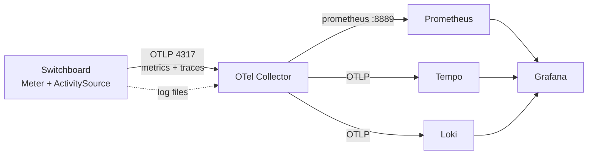

# Switchboard Observability Plan — OpenTelemetry, Prometheus, Grafana

Status: **Planned** — ships as part of the unreleased **v5.0.0** (no version bump). This is an
implementation plan, not yet built. Each task has a checkbox a
developer can annotate (`[ ]` → `[x]`) as work lands. Acceptance criteria are stated per workstream and a
final end-to-end verification section closes it out.

## Context

Switchboard already computes almost everything an operator wants to graph — `RequestHistoryCaptureService`
records method/status/duration/body-sizes per request, `OriginServer` carries live
`ActiveRequests`/`PendingRequests`/`Healthy`/`EwmaLatencyMs`/`EjectedUntilUtc`, and the health service
tracks uptime and consecutive success/failure. None of it leaves the process in a standard form. This work
exposes that instrumentation through OpenTelemetry so metrics, traces, and logs land in Prometheus, Tempo,
and Loki, viewable in a provisioned Grafana — turnkey via `docker compose up`.

### Decisions (locked)

- **Unified OpenTelemetry SDK.** Instrument once with `System.Diagnostics.Metrics.Meter` + `ActivitySource`,
  export via OTLP; the Prometheus scrape surface is produced by the OpenTelemetry Prometheus exporter. One
  instrumentation layer, multiple exporters.
- **All three signals:** metrics **+** traces **+** logs.
- **Baked into the main `Docker/compose.yaml`** — the observability containers start with the stack.
- **Frontend:** telemetry config in `SettingsView` **+** a new read-only **Observability** view.
- Follows `c:\code\agents\requirements` (`CODE_STYLE.md`, `BACKEND_TEST_ARCHITECTURE.md`,
  `DASHBOARD_STYLE_AND_USABILITY.md`, `WRITING_DOCUMENTS.md`, `REPOSITORY_REQUIREMENTS.md`).

### Signal topology



All three signals flow **OTLP → OTel Collector**, and the Collector fans out: metrics to a Prometheus
scrape surface (the Collector's `prometheus` exporter, scraped by Prometheus), traces to Tempo, logs to
Loki. Grafana is provisioned with all three datasources and starter dashboards.

**Dependency note (important):** the OpenTelemetry .NET *Prometheus* exporters are only published as
prerelease (`-rc`). `Switchboard.Core` is a GA-published NuGet package and this repo requires warning-free
builds, so Switchboard depends **only on GA OTel packages** (`OpenTelemetry`,
`OpenTelemetry.Exporter.OpenTelemetryProtocol`) and exports **everything over OTLP**. The Prometheus scrape
endpoint is provided by the Collector, not by an in-process `HttpListener`. (A direct Switchboard
`/metrics` can be added later if the Prometheus exporter reaches GA.)

> **Implementation note (as-built).** The workstream detail below was drafted around an in-process
> Prometheus `HttpListener` on `:9464`; that approach was superseded by the OTLP-only design above to keep
> the build warning-free. Concretely, as shipped: (1) `TelemetryMetricsSettings` is `Enable` +
> `ExportIntervalMs` (no `Prometheus*`/`ExportViaOtlp` fields); (2) `TelemetryService` builds only the
> OTLP metric + trace providers — logs are collected by the Collector's `filelog` receiver, not an
> in-process log provider; (3) `Switchboard.Core` depends only on `OpenTelemetry` and
> `OpenTelemetry.Exporter.OpenTelemetryProtocol` (`1.17.0`); (4) the Observability view shows the OTLP
> endpoint/protocol rather than a Switchboard scrape URL; (5) the integration tests assert via an
> in-process `MeterListener`/`ActivityListener` instead of scraping `/metrics`; (6) the restart-required
> management paths are `Telemetry.Metrics.Enable`/`ExportIntervalMs` (there is no `Prometheus*` path). The
> **Using it** section at the end of this document reflects the final shape. Checklist wording below that
> still says "`:9464`", "scrape", or "`HttpListener`" is historical.

---

## 1. Backend — `Switchboard.Core`

Comply with `CODE_STYLE.md` throughout: one class/enum per file; usings inside the namespace (system first,
alphabetized); public members documented with default/min/max; backing fields with **range clamping** in
setters; no `var`, no tuples, no `System.Text.Json` DOM; `.ConfigureAwait(false)`; `CancellationToken` on
async; `Interlocked`/`Volatile` for counters. New instruments must not add unbounded label cardinality.

### 1.1 Settings model
- [ ] `Settings/TelemetrySettings.cs` — root telemetry block. Members (backing fields + clamps where noted):
  `Enable` (bool, default false), `ServiceName` (string, default `"switchboard"`),
  `Metrics` (`TelemetryMetricsSettings`), `Traces` (`TelemetryTracesSettings`), `Logs` (`TelemetryLogsSettings`),
  `Otlp` (`OtlpExporterSettings`).
- [ ] `Settings/TelemetryMetricsSettings.cs` — `Enable` (bool, default true), `PrometheusEnable` (bool,
  default true), `PrometheusHostname` (string, default `"*"`), `PrometheusPort` (int, default 9464, clamp
  1–65535), `PrometheusPath` (string, default `"/metrics"`), `ExportViaOtlp` (bool, default false — avoid
  double-counting when Prometheus scrapes directly).
- [ ] `Settings/TelemetryTracesSettings.cs` — `Enable` (bool, default true), `SamplingRatio` (double,
  default 1.0, clamp 0.0–1.0), `PropagateToOrigin` (bool, default true — inject W3C `traceparent` on the
  forwarded request).
- [ ] `Settings/TelemetryLogsSettings.cs` — `Enable` (bool, default true), `MinimumSeverity` (int mirror of
  the logging severity floor, default 1, clamp 0–7).
- [ ] `Settings/OtlpExporterSettings.cs` — `Endpoint` (string, default `"http://localhost:4317"`),
  `Protocol` (string enum-ish `"grpc"`|`"httpprotobuf"`, default `"grpc"`), `TimeoutMs` (int, default 10000,
  clamp 1000–120000), `Headers` (string, default null — comma-separated `k=v` for auth to hosted backends).
- [ ] `SwitchboardSettings.cs` — add `public TelemetrySettings Telemetry { get; set; } = new TelemetrySettings();`
  following the existing section pattern (see `Logging`, `OpenApi`, `Management` at lines 21/102/136).

### 1.2 Instrument registry + service
- [ ] `Telemetry/SwitchboardTelemetry.cs` — static holder for the shared `Meter` (name
  `"Switchboard"`), the `ActivitySource` (name `"Switchboard"`), and every instrument (see the catalog in
  §2). Instruments created once, referenced by the gateway/health code. Observable gauges register a
  callback that snapshots `_Settings.Origins` at scrape time. No behavior when telemetry is disabled (the
  instruments are cheap no-ops when no provider listens).
- [ ] `Services/TelemetryService.cs` (`IDisposable`) — builds the OTel `MeterProvider`, `TracerProvider`,
  and `LoggerProvider` from `TelemetrySettings`: resource attributes (`service.name`, `service.version` =
  `Constants.SoftwareVersion`, `service.instance.id`), the `Meter`/`ActivitySource` sources, the Prometheus
  exporter (HttpListener on `PrometheusPort`+`PrometheusPath`), and the OTLP exporter (endpoint/protocol/headers)
  for traces + logs (+ metrics if `ExportViaOtlp`). Owns disposal of all providers. Full Dispose pattern.
- [ ] `SwitchboardDaemon.cs` — construct `TelemetryService` **before** `HealthCheckService`/`GatewayService`
  (near the services region, ~line 353–405) so instruments exist before the hot path runs; dispose it in the
  daemon's `Dispose`. No-op cleanly when `Telemetry.Enable` is false.

### 1.3 Metrics + trace instrumentation (hot path)
- [ ] `GatewayService.DefaultRoute` — increment `switchboard_requests_total{endpoint,method,code}` on the
  final response; increment `switchboard_gateway_rejections_total{reason}` for the 429/413/401/502/505 paths
  (reuse the existing rejection branches from the routing work).
- [ ] `GatewayService.ProxyRequest` — start an `Activity` ("proxy" span) around the attempt with attributes
  `switchboard.endpoint`, `switchboard.origin`, `http.request.method`, `url.path` (template, not raw),
  `http.response.status_code`; record `switchboard_request_duration_seconds{endpoint,origin}` (reuse the
  existing `Timestamp ts`) and body-size histograms. When `Traces.PropagateToOrigin`, inject the W3C
  `traceparent` header onto the outgoing `RestRequest` so the origin can continue the trace.
- [ ] `GatewayService.RecordProxyOutcome` — the existing central outcome hook increments
  `switchboard_origin_requests_total{origin,code}`, `switchboard_retries_total`/`switchboard_failovers_total`,
  and sets the ejection gauge; this keeps trace/metric emission out of duplicated branches.
- [ ] `HealthCheckService` — increment `switchboard_origin_health_checks_total{origin,result}` per probe and
  `switchboard_origin_ejections_total{origin}` on ejection; expose `switchboard_origin_up`,
  `switchboard_origin_ejected`, `switchboard_origin_active_requests`, `switchboard_origin_pending_requests`,
  `switchboard_origin_ewma_latency_seconds`, `switchboard_origin_uptime_ratio` as **observable gauges** read
  from `_Settings.Origins` at collection time (no per-request work).
- [ ] `switchboard_build_info{version}` gauge = 1; `switchboard_config_origins`/`switchboard_config_endpoints`
  observable gauges.

### 1.4 Logs
- [ ] Primary: emit Switchboard log events over OTLP via the OTel `LoggerProvider`. Investigate whether
  `SyslogLogging.LoggingModule` exposes a message hook/sink; if so, add `Telemetry/OtelLogForwarder.cs` that
  forwards events (severity-mapped) to the OTel logger. **Risk/decision point** — if no hook exists, do not
  refactor the logging path.
- [ ] Guaranteed fallback (and the compose default): the OTel Collector's `filelog` receiver tails the shared
  `/app/logs` volume → Loki. This satisfies "logs in the pipeline" with zero backend risk; keep it regardless
  and treat app-side OTLP logs as the enhancement.

### 1.5 NuGet
- [ ] Add to `Switchboard.Core.csproj` (multi-target net8.0;net10.0), latest stable OpenTelemetry 1.x:
  `OpenTelemetry`, `OpenTelemetry.Exporter.OpenTelemetryProtocol`, `OpenTelemetry.Exporter.Prometheus.HttpListener`.
  Verify net10.0 support; pin versions.

**Acceptance:** with `Telemetry.Enable=true`, `GET http://host:9464/metrics` returns Prometheus exposition
including the §2 series; proxied requests increment the counters; a span per proxied request is produced and
`traceparent` reaches the origin; build is warning-free.

---

## 2. Metrics catalog (authoritative series)

Label only by **bounded** sets — `endpoint` (identifier, not raw path), `origin`, `method`, status `code`,
`reason`, `result`. **Never** label by raw URL path or client IP.

| Metric | Type | Labels |
|---|---|---|
| `switchboard_requests_total` | counter | endpoint, method, code |
| `switchboard_request_duration_seconds` | histogram | endpoint, origin |
| `switchboard_request_body_bytes` / `switchboard_response_body_bytes` | histogram | endpoint |
| `switchboard_gateway_rejections_total` | counter | reason (429/413/401/502/505) |
| `switchboard_origin_requests_total` | counter | origin, code |
| `switchboard_origin_active_requests` / `switchboard_origin_pending_requests` | gauge | origin |
| `switchboard_origin_up` / `switchboard_origin_ejected` | gauge (0/1) | origin |
| `switchboard_origin_health_checks_total` | counter | origin, result |
| `switchboard_origin_ejections_total` | counter | origin |
| `switchboard_origin_ewma_latency_seconds` / `switchboard_origin_uptime_ratio` | gauge | origin |
| `switchboard_lb_selections_total` | counter | endpoint, origin |
| `switchboard_retries_total` / `switchboard_failovers_total` | counter | endpoint |
| `switchboard_build_info` | gauge (=1) | version |
| `switchboard_config_origins` / `switchboard_config_endpoints` | gauge | — |

Traces: one span per proxied request named `proxy {endpoint}`, attributes above; child of the incoming
request's context when the client sends `traceparent`; propagated downstream. Logs: structured records
carrying `trace_id`/`span_id` where available so Grafana can pivot logs↔traces.

---

## 3. Frontend — `dashboard/`

Follow `DASHBOARD_STYLE_AND_USABILITY.md` and existing paradigms; add a `title` tooltip to every new control
(consistent with the dashboard-wide tooltip pass). English i18n keys authored; other locales fall back.

### 3.1 Settings
- [ ] `SettingsView.jsx` — add a `telemetry` entry to the `SECTIONS` registry (same shape as existing
  sections). Fields (with `labelKey`/`tipKey`, restart-required where the exporter must rewire):
  `telemetry.enable` (toggle, restart), `telemetry.serviceName` (text), `telemetry.metrics.prometheusEnable`
  (toggle, restart), `telemetry.metrics.prometheusPort` (number, restart), `telemetry.traces.enable`
  (toggle, restart), `telemetry.traces.samplingRatio` (number 0–1), `telemetry.traces.propagateToOrigin`
  (toggle), `telemetry.logs.enable` (toggle, restart), `telemetry.otlp.endpoint` (text, restart),
  `telemetry.otlp.protocol` (select grpc/httpprotobuf, restart).
- [ ] Add all `settings.field*Tip` + label keys to `en/translation.json`.

### 3.2 Observability view
- [ ] `components/views/ObservabilityView.jsx` — read-only status page using existing `PageHeader`,
  `Metric`/cards, `Badge`, `CopyableId`. Shows: telemetry enabled state; the Prometheus scrape URL
  (`host:9464/metrics`, copyable); OTLP endpoint + protocol; enabled signals (metrics/traces/logs badges);
  sampling ratio; and an **Open Grafana** external link (URL from a build-time/env config, default
  `http://localhost:3001`). No new backend endpoint required — read from `GET /settings`.
- [ ] `Sidebar` + router — add the Observability nav item + route, following the existing view registration.
- [ ] i18n `observability.*` keys in `en`.

**Acceptance:** Settings shows the telemetry section with restart-required annotations working; the
Observability view renders live status and the Grafana link; `npx eslint src` and `npm run build` clean; all
9 locale JSONs parse.

---

## 4. Backend config surface (management API)

- [ ] `ManagementService.cs` — add the telemetry paths to `_RestartRequiredSettings` (line 71):
  `Telemetry.Enable`, `Telemetry.Metrics.PrometheusEnable`, `Telemetry.Metrics.PrometheusPort`,
  `Telemetry.Traces.Enable`, `Telemetry.Logs.Enable`, `Telemetry.Otlp.Endpoint`, `Telemetry.Otlp.Protocol`.
  Runtime-editable (hot): `Telemetry.Traces.SamplingRatio`, `Telemetry.Traces.PropagateToOrigin`,
  `Telemetry.ServiceName` — add to `_RuntimeEditableSettings` (line 93) where the running providers can pick
  them up without a restart (else mark restart-required).
- [ ] Confirm `GetSettingsAsync`/`UpdateSettingsAsync` round-trip the new `Telemetry` block (they serialize
  the whole `SwitchboardSettings`, so no per-field code — verify masking is not needed except OTLP `Headers`
  if it can carry a secret → mask like `AdminToken`).

---

## 5. Docker — `Docker/`

Baked into the default stack. Reuse `.yaml` (not `.yml`) per `REPOSITORY_REQUIREMENTS.md`.

- [ ] `Docker/compose.yaml` — add services on a shared network: `otel-collector`, `prometheus`, `tempo`,
  `loki`, `grafana`. Wire `switchboard` to export OTLP to `otel-collector:4317` and expose `9464` for scrape;
  mount the shared `./logs` volume into `otel-collector` (filelog). Ports (host): Grafana `3001` (avoid the UI
  on 3000), Prometheus `9090`, Switchboard metrics `9464`. `depends_on` + healthchecks; `restart: unless-stopped`.
- [ ] Config files under `Docker/telemetry/`:
  - [ ] `otel-collector-config.yaml` — receivers: `otlp` (4317/4318), `filelog` (/app/logs/*.log);
    exporters/pipelines: traces→Tempo, logs→Loki, metrics→(optional) Prometheus remote write; `service` block.
  - [ ] `prometheus.yml` — scrape job targeting `switchboard:9464` at `/metrics`.
  - [ ] `tempo.yaml`, `loki-config.yaml` — minimal single-binary configs.
  - [ ] `grafana/provisioning/datasources/datasources.yaml` — Prometheus, Tempo, Loki datasources (with
    trace↔log correlation).
  - [ ] `grafana/provisioning/dashboards/dashboards.yaml` + `grafana/dashboards/switchboard-overview.json` —
    a starter dashboard (request rate/errors/latency p50-p95-p99, per-origin load/health/ejections, LB
    selection split, retries/failovers). Ships turnkey.
- [ ] `Docker/sb.json` (and `sb.sqlite/mysql/postgres/sqlserver.json`) — add a `Telemetry` block; **enabled**
  in the compose configs (so the baked-in stack shows data out of the box), pointing OTLP at
  `http://otel-collector:4317` and Prometheus on `9464`.
- [ ] `Docker/factory/sb.json` + `reset.bat`/`reset.sh` — telemetry-enabled factory variant so the demo
  reset seeds an observable instance.
- [ ] Compose image tags stay `v5.0.0` (no version bump). Update `compose.sqlite/mysql/postgres/sqlserver.yaml`
  overlays to include the telemetry services (or document that the base compose carries them).

**Acceptance:** `cd Docker && docker compose up` brings up the stack; Grafana at `:3001` shows the starter
dashboard populated after traffic; Prometheus targets show `switchboard:9464` UP; traces appear in Tempo and
logs in Loki.

---

## 6. Tests — `src/Test.*`

Per `BACKEND_TEST_ARCHITECTURE.md` (Touchstone; descriptors in `Test.Shared`; no console output). Positive
**and** negative per capability. Register new suites in `SwitchboardSuites.All` and the unit suite in the
`--unit` filter.

### 6.1 Unit (network-free) — `TelemetryUnitSuites.cs`
- [ ] `TelemetrySettings` defaults + clamping (port 1–65535, sampling 0.0–1.0, timeout bounds).
- [ ] Instrument registry constructs; metric names/labels match the §2 catalog (guards against accidental
  cardinality/renames).
- [ ] Negative: disabled telemetry produces no providers / instruments are inert.

### 6.2 Integration (real daemon) — `TelemetrySuites.cs`
- [ ] Harness: extend `ProxyHarness` `configure` to enable `Telemetry` with a **random free metrics port**
  (reuse the free-port helper); expose it so the test can scrape. Extend `OriginHost` to record the last
  received request headers so a test can assert `traceparent` propagation.
- [ ] Scrape present (positive): telemetry on → `GET :port/metrics` returns 200 Prometheus text containing
  `switchboard_build_info` and the origin gauges.
- [ ] Scrape absent (negative): telemetry off → metrics endpoint not served.
- [ ] Counters increment: send N requests through the proxy, re-scrape, assert `switchboard_requests_total`
  rose by N and `switchboard_request_duration_seconds` count rose.
- [ ] Rejections: force 429 (rate limit) and 502 (all origins down) and assert
  `switchboard_gateway_rejections_total{reason=...}` increments; negative: no rejection series without the
  condition.
- [ ] Per-origin: assert `switchboard_origin_up` / `active_requests` gauges present with the origin label.
- [ ] Traces: register an in-memory span exporter in-process; assert one span per proxied request with the
  expected attributes; assert `traceparent` reached the origin (via the OriginHost header capture); negative:
  traces disabled → no spans.
- [ ] Logs wiring: assert the log pipeline config is honored (app-OTLP path if implemented; otherwise a
  config/smoke assertion — full Collector→Loki is validated manually in §8).

**Acceptance:** full suite green including the new telemetry unit + integration suites; `--unit` runs the
telemetry unit suite.

---

## 7. Docs (no version bump — part of the unreleased v5.0.0)

- [ ] **This file** doubles as the design reference; after implementation, add a user-facing "Telemetry &
  Observability" section (how to enable, ports, Grafana, sampling, security) — human-voiced per
  `WRITING_DOCUMENTS.md`.
- [ ] `REST_API.md` — document the `Telemetry` settings block in the settings model, the `/metrics` scrape
  surface (separate port, unauthenticated, secure by network), and link this doc.
- [ ] `README.md` — add an Observability feature bullet to the existing "What's New in v5.0.0" list; link this doc.
- [ ] `CHANGELOG.md` — add a bullet to the existing `v5.0.0` section (do **not** create a new version).
- [ ] `DOCKERHUB_README.md` — mention the bundled observability stack.
- [ ] **No version change.** The version stays `5.0.0` everywhere; telemetry is part of the same unreleased
  release, so `Constants.cs`, the csproj, `package.json`, compose tags, and `sb*.json` are left as-is.

---

## 8. Compliance checklist

- [ ] Backend: one class/enum per file; usings inside namespace, alphabetized; public XML docs with
  default/min/max; backing-field clamping; no `var`/tuples/STJ-DOM; `.ConfigureAwait(false)`; `CancellationToken`
  on async; `TelemetryService` implements the full `IDisposable` pattern.
- [ ] No `Console.WriteLine` in library code (telemetry status via `_Logging`).
- [ ] Metrics cardinality reviewed — no raw path/IP labels.
- [ ] Frontend: existing UI paradigms (SECTIONS registry, PageHeader/Metric/Badge, form classes); tooltips on
  every new control; i18n keys added.
- [ ] `.yaml` (not `.yml`) for all Docker compose/config; secrets (OTLP headers) masked like `AdminToken`.

## 9. End-to-end verification

- [ ] `cd src && dotnet build Switchboard.sln` — 0 warnings/errors (net8.0 + net10.0).
- [ ] `dotnet run --project Test.Automated --framework net8.0` — full suite green incl. telemetry suites;
  `-- --unit` runs the telemetry unit suite.
- [ ] `cd dashboard && npx eslint src && npm run build` — clean; 9 locale JSONs parse.
- [ ] `cd Docker && docker compose up -d` — all containers healthy; Prometheus target UP; Grafana starter
  dashboard populated after driving traffic (e.g. via `LoadGenerator`); a trace visible in Tempo with the
  origin as a child/propagated context; logs visible in Loki and pivotable from a trace.
- [ ] Toggle `Telemetry.Enable` off in Settings → restart → `/metrics` no longer served; back on → restored.

## 10. Phasing (suggested commit order)

1. Settings model + `TelemetryService` + Prometheus scrape + metrics catalog (the 80/20) → build/tests green.
2. Traces + `traceparent` propagation → tests.
3. Logs (filelog default; app-OTLP if `SyslogLogging` hook exists).
4. Docker stack + Grafana provisioning + factory.
5. Frontend (Settings section + Observability view + i18n).
6. Docs (add to the existing v5.0.0 CHANGELOG/README sections — no version bump).
7. Full build/test/lint, then merge.

## Open risks

- **App-side OTLP logs** are out of scope for the backend; logs reach Loki through the Collector's
  `filelog` receiver tailing the Switchboard log files. This keeps the logging path untouched and the
  build free of the experimental OTel Logs Bridge API.
- **OTel net10.0 support** — the GA `OpenTelemetry` / `OpenTelemetry.Exporter.OpenTelemetryProtocol`
  packages (pinned at `1.17.0`) target `netstandard2.0`/`net8.0` and are consumed cleanly on `net10.0`.

---

## Using it

Telemetry is off by default in a standalone build and **on** in the bundled Docker stack.

**Turnkey (Docker):**

```bash
cd Docker
docker compose up -d
```

This starts Switchboard alongside the OpenTelemetry Collector, Prometheus, Tempo, Loki, and Grafana.
Give the containers a few seconds to come up, then:

| Service | URL | Notes |
|---|---|---|
| Grafana | http://localhost:3001 | No login required (anonymous access, Admin role) |
| Prometheus | http://localhost:9090 | Under *Status → Targets*, the `otel-collector` job should read **UP** |
| Switchboard dashboard | http://localhost:3000 | The **Observability** view shows live telemetry status |

**Getting into Grafana:**

1. Open **http://localhost:3001**. You are **not** prompted to log in — the stack enables anonymous
   access with the Admin role, so there are no credentials to enter. (If you later disable anonymous
   access, Grafana's default login is `admin` / `admin`.)
2. The Prometheus, Tempo, and Loki data sources are already wired up — nothing to configure.
3. Open the pre-provisioned dashboard: left sidebar → **Dashboards** → **Switchboard Overview**.
4. **Panels start empty.** They fill once traffic flows through the proxy and the first export/scrape
   interval elapses (~15 s). Generate some traffic, e.g. `curl http://localhost:8000/` a few times (or
   run the `LoadGenerator` project), then refresh — request rate, latency percentiles, and per-origin
   health/load should appear.
5. For traces and logs, use **Explore** (compass icon): pick the **Tempo** data source to find spans
   (search by service `switchboard`), or **Loki** to query logs (`{service_name="switchboard"}`). From a
   Tempo span you can jump to its correlated logs, and from a Loki line back to its trace.

The Switchboard dashboard's **Observability** view (under *Operate*) reports the enabled signals, OTLP
endpoint, sampling ratio, and links straight out to Grafana and Prometheus. Configuration lives under
**Settings → Telemetry & Observability**.

**Enabling telemetry in a standalone deployment** — set the `Telemetry` block in `sb.json` (or via the
management API / dashboard) and point OTLP at your collector:

```json
"Telemetry": {
  "Enable": true,
  "ServiceName": "switchboard",
  "Metrics": { "Enable": true, "ExportIntervalMs": 15000 },
  "Traces": { "Enable": true, "SamplingRatio": 1.0, "PropagateToOrigin": true },
  "Logs": { "Enable": true, "MinimumSeverity": 1 },
  "Otlp": { "Endpoint": "http://otel-collector:4317", "Protocol": "grpc", "TimeoutMs": 10000, "Headers": null }
}
```

Most fields require a restart to rewire the exporters; `Traces.PropagateToOrigin` applies live. The OTLP
`Headers` value is treated as a secret and masked by the management API. Metrics reach Prometheus through
the Collector's scrape surface (`otel-collector:8889`), so Switchboard exposes **no** unauthenticated
metrics port of its own.
